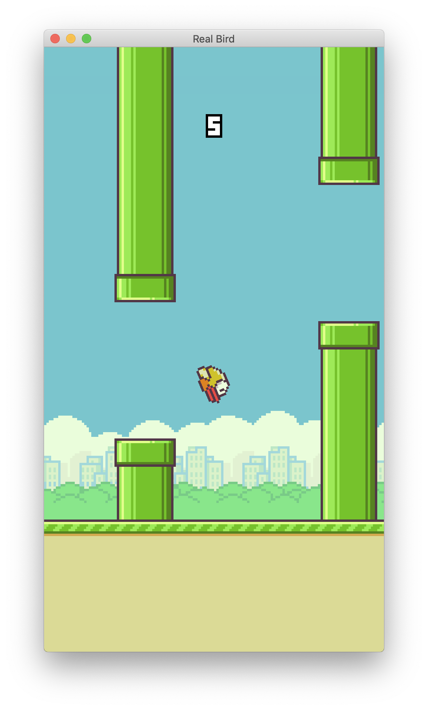

# Real Bird

Another flappy bird, implemented with Java and rendered with OpenGL wrapper [LWJGL](https://www.lwjgl.org/).

## Build

- Download latest LWJGL release from [here](https://github.com/LWJGL/lwjgl3/releases). Plus, create a directory `lib` in root and copy these package to `lib`:

  - `lwjgl-glfw-natives-${SYSTEM_TYPE}.jar`
  - `lwjgl-natives-${SYSTEM_TYPE}.jar`
  - `lwjgl-opengl-natives-${SYSTEM_TYPE}.jar`
  - `lwjgl-stb.jar`
  - `lwjgl-glfw.jar`
  - `lwjgl-opengl.jar`
  - `lwjgl-stb-natives-${SYSTEM_TYPE}.jar`
  - `lwjgl.jar`

  Here, `${SYSTEM_TYPE}` is the identifier of your operating system. After copying, configure project structure in your IDE.

- Add `-XstartOnFirstThread` in vm options.

## Screenshot

